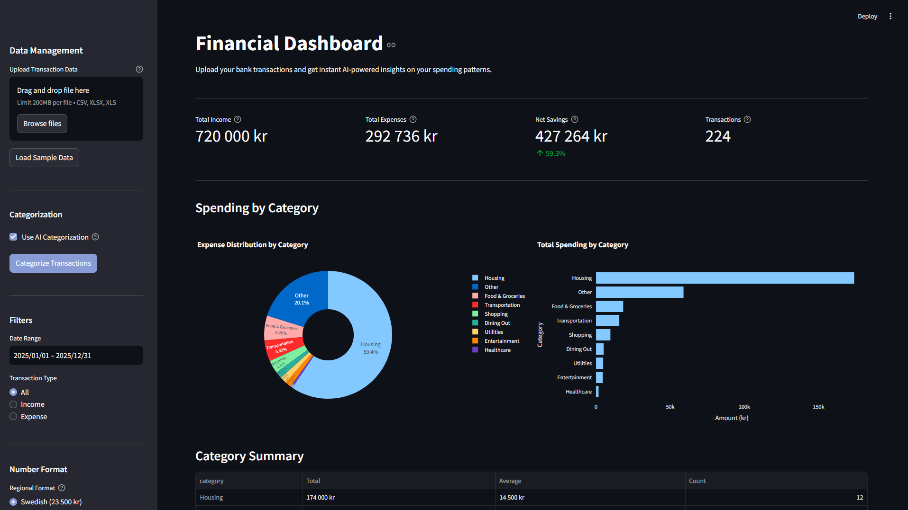
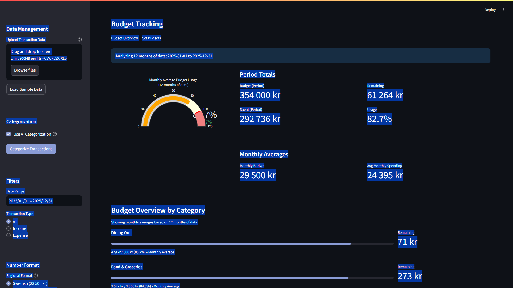
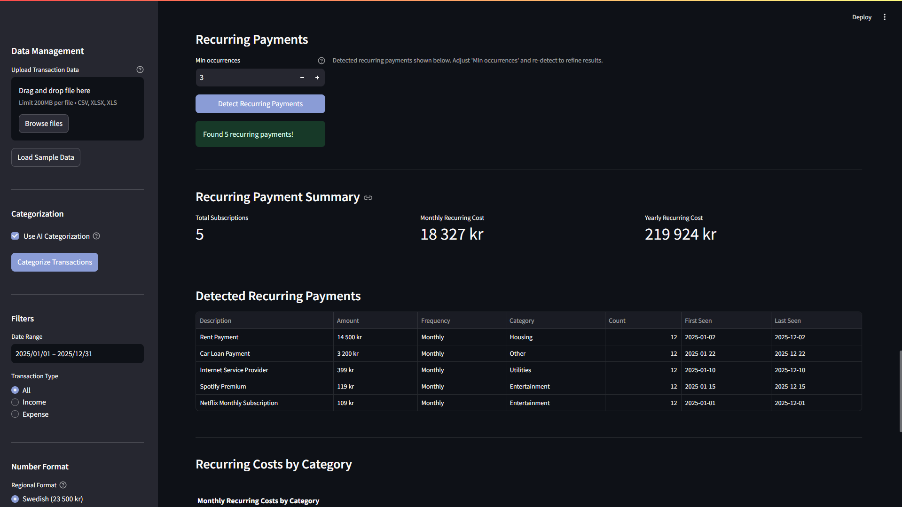
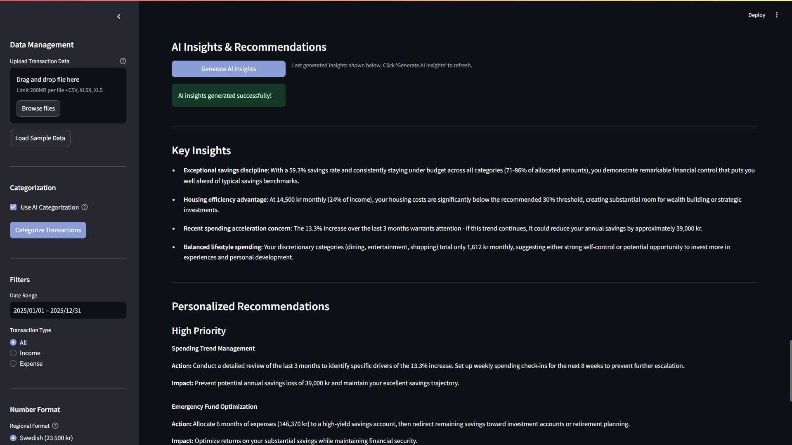

# Financial Dashboard

[](https://opensource.org/licenses/MIT)
[](https://www.python.org/downloads/)

AI-powered financial dashboard for transaction analysis, budget tracking, and spending insights. Upload bank transactions and get instant analytics with personalized recommendations.



## The Problem

**For Individuals:**
- Manual budget tracking takes hours each month
- Difficult to identify spending patterns
- Hard to track subscriptions and recurring costs
- No insights on where money actually goes
- Can't compare spending against realistic budgets

**Time Cost:**
- Monthly budget review: 3-5 hours
- Subscription audit: 2-3 hours
- Spending analysis: 4-6 hours
- **Total: 9-14 hours/month**

## The Solution

Upload your bank transactions once. Get instant analysis with AI-powered insights, budget tracking, and recurring payment detection.

**How it works:**
1. Upload CSV/Excel with transaction data (or use sample data)
2. Categorize transactions automatically (rule-based or AI)
3. Set monthly budgets per category
4. Generate AI-powered insights and recommendations
5. Track recurring payments and subscriptions
6. Export comprehensive reports

**Key Features:**
- **Smart categorization** - AI or rule-based transaction sorting
- **Budget tracking** - Visual progress bars and alerts
- **Recurring payment detection** - Auto-identify subscriptions
- **AI insights** - Personalized spending recommendations
- **Swedish & International formats** - Multi-language support
- **Beautiful visualizations** - Interactive charts with Plotly

## Quick Start

### For Non-Technical Users

1. Contact your tech-savvy friend to set up the application
2. Once running, open the web interface
3. Upload your bank transaction CSV/Excel file
4. Click "Categorize Transactions"
5. Explore your spending patterns!

### For Developers
```bash
# Clone repository
git clone https://github.com/MattiasNyqvist/financial-dashboard.git
cd financial-dashboard

# Setup Python environment
python -m venv venv
venv\Scripts\activate  # Windows
source venv/bin/activate  # Mac/Linux

# Install dependencies
pip install -r requirements.txt

# Configure API key (for AI features)
echo ANTHROPIC_API_KEY=your-api-key-here > .env

# Run application
streamlit run app.py
```

Open browser at http://localhost:8501

## Features in Detail

### Smart Transaction Categorization

**Rule-Based (Fast):**
Automatic categorization using keyword matching:
- Food & Groceries: ICA, Coop, Hemköp, Willys
- Transportation: SL, Shell, Circle K, Gas
- Entertainment: Netflix, Spotify, Cinema
- And more...

**AI-Powered (Smart):**
Uses Claude AI for intelligent categorization:
- Understands context and patterns
- Learns from transaction descriptions
- Handles edge cases and ambiguity
- More accurate than simple keywords

### Budget Tracking



Set monthly spending limits and track progress:

**Features:**
- **Visual gauge** showing overall budget health
- **Progress bars** for each category
- **Auto-suggest budgets** based on historical spending
- **Period analysis** handles multi-month data correctly
- **Color-coded alerts** (green/orange/red)

**Insights:**
- See which categories are over budget
- Track monthly vs period totals
- Get monthly averages automatically
- Set realistic spending goals

### Recurring Payment Detection



Automatically detect subscriptions and recurring bills:

**Detection Algorithm:**
- Groups similar transactions by description
- Checks amount consistency (within 5% variance)
- Identifies payment frequency (Monthly/Quarterly/Yearly/Weekly)
- Requires minimum occurrences (configurable)

**Shows:**
- All detected subscriptions
- Total monthly recurring cost
- Total yearly recurring cost
- Category breakdown
- First and last occurrence dates

**Perfect for:**
- Subscription audits
- Finding forgotten recurring charges
- Budget planning with fixed costs
- Cost optimization

### AI-Powered Insights



Get personalized spending recommendations from Claude AI:

**Key Insights:**
- Spending pattern observations
- Budget adherence analysis
- Trend identification
- Positive habits recognition

**Actionable Recommendations:**
- Prioritized by impact (HIGH/MEDIUM/LOW)
- Specific amounts and timeframes
- Realistic, achievable changes
- Category-specific suggestions

**Example Insights:**
- "You're spending 188% over budget on Entertainment - consider reducing streaming subscriptions"
- "Strong savings rate of 3.8% despite high fixed costs"
- "Reduce restaurant visits from 429 kr to 300 kr monthly for 1,500 kr annual savings"

### Data Analysis & Visualization

**Interactive Dashboards:**
- Summary metrics (Income, Expenses, Savings, Savings Rate)
- Category breakdown (Pie chart + Bar chart)
- Timeline visualization (Income vs Expenses over time)
- Transaction history with filtering
- Export to CSV

**Filtering Options:**
- Date range selection
- Transaction type (All/Income/Expense)
- Category filtering (after categorization)

## Tech Stack

**Backend:**
- Python 3.11+
- Pandas (data manipulation)
- NumPy (statistical analysis)

**AI & NLP:**
- Claude AI via Anthropic API (intelligent categorization & insights)
- Custom rule-based engine for fast categorization

**Frontend:**
- Streamlit (web interface)
- Plotly (interactive visualizations)

**Data Processing:**
- OpenPyXL (Excel handling)
- Support for Swedish & International CSV formats

**Why these choices:**
- **Pandas:** Industry standard for financial data
- **Plotly:** Professional, interactive charts
- **Claude AI:** Best-in-class reasoning for financial insights
- **Streamlit:** Rapid development, clean UI, no frontend coding

## Usage Examples

### Basic Workflow

1. **Upload Data**
   - Click "Upload Transaction Data"
   - Select CSV or Excel file
   - Or click "Load Sample Data" to try demo

2. **Categorize**
   - Choose AI or Rule-based categorization
   - Click "Categorize Transactions"
   - Wait a few seconds

3. **Analyze**
   - View spending by category
   - Check budget status
   - Detect recurring payments
   - Generate AI insights

4. **Export**
   - Download categorized data as CSV
   - Save for records or further analysis

### File Format Requirements

**Required columns:**
- `date` - Transaction date (YYYY-MM-DD)
- `description` - Transaction description
- `amount` - Transaction amount (negative for expenses, positive for income)

**Optional columns:**
- `account` - Account name

**Supported formats:**

**Swedish CSV:**
```csv
date;description;amount;account
2025-01-01;Netflix;-109,00;Credit Card
2025-01-15;Salary;60000,00;Checking
```

**International CSV:**
```csv
date,description,amount,account
2025-01-01,Netflix,-109.00,Credit Card
2025-01-15,Salary,60000.00,Checking
```

Both formats work automatically - no configuration needed!

## Business Value

### ROI Calculator (Individual/Family)

**Assumptions:**
- Monthly budget review: 4 hours
- Subscription audit: 2 hours (quarterly)
- Spending analysis: 3 hours
- Personal time value: 300 SEK/hour

**Current Annual Cost:**
- Monthly reviews: 4h × 12 = 48h
- Quarterly audits: 2h × 4 = 8h
- Monthly analysis: 3h × 12 = 36h
- **Total: 92 hours × 300 SEK = 27,600 SEK/year**

**With Financial Dashboard:**
- Monthly reviews: 30 minutes
- Quarterly audits: 15 minutes
- Monthly analysis: 30 minutes
- **Total: ~15 hours × 300 SEK = 4,500 SEK/year**

**Savings: 23,100 SEK/year**

**Additional Benefits:**
- Better spending visibility → potential 5-10% cost reduction
- Catch forgotten subscriptions → 500-2,000 SEK/year
- Optimized budgets → 3-5% better savings rate
- **Total value: 25,000-35,000 SEK/year**

*Scale based on your time value and financial complexity.*

### Additional Benefits

**For Individuals:**
- Data-driven spending decisions
- Clear budget adherence tracking
- Quick answers to financial questions
- Professional reports in minutes

**For Families:**
- Shared financial visibility
- Collaborative budget planning
- Teach children about money
- Track family expenses together

**For Financial Goals:**
- Identify savings opportunities
- Track progress toward goals
- Optimize spending categories
- Build better financial habits

## Project Structure
```
financial-dashboard/
├── app.py                       # Main Streamlit application
├── data_processor.py            # Data loading and processing
├── categorizer.py               # Transaction categorization
├── budget_manager.py            # Budget tracking UI and logic
├── ai_insights.py              # AI-powered analysis
├── recurring_detector.py        # Recurring payment detection
├── version.py                   # Version information
├── requirements.txt             # Python dependencies
├── LICENSE                      # MIT License
├── .env                        # API key (not in git)
├── .streamlit/
│   └── config.toml             # UI theme configuration
├── data/
│   └── sample_transactions.csv  # Example transaction data
├── docs/
│   └── screenshots/            # Application screenshots
└── README.md                   # This file
```

## Configuration

### API Key Setup

**For AI features (optional but recommended):**

1. Get API key from https://console.anthropic.com/
2. Create `.env` file in project root:
```
   ANTHROPIC_API_KEY=your-api-key-here
```
3. Restart application

**Without API key:**
- Rule-based categorization still works
- Budget tracking works
- Recurring payment detection works
- Only AI Insights requires API key

### Number Format

Choose between Swedish and International formats:
- **Swedish:** 23 500 kr (space separator, comma decimal)
- **International:** 23,500 kr (comma separator, period decimal)

Select in sidebar under "Number Format"

### Budget Customization

**Auto-suggest budgets:**
1. Upload and categorize your data
2. Go to Budget Tracking → Set Budgets
3. Click "Suggest Budgets Based on Spending"
4. Adjust as needed
5. Save

**Manual setup:**
- Set monthly limit for each category
- Budgets persist across sessions
- Reset to defaults anytime

## Deployment Options

### Option 1: Local Deployment (Recommended)
```bash
streamlit run app.py
```

Access at http://localhost:8501

**Best for:**
- Personal use
- Sensitive financial data
- Full control over data

### Option 2: Internal Server

Deploy on home/office server:
```bash
streamlit run app.py --server.port 8501 --server.address 0.0.0.0
```

Configure firewall for local network access.

**Best for:**
- Family sharing
- Small team use
- Controlled environment

### Option 3: Cloud Deployment

**NOT RECOMMENDED for financial data.**

Use local or internal deployment for privacy and security.

## Troubleshooting

### Upload Errors

**Problem:** CSV file won't load  
**Solution:** 
- Check file has required columns (date, description, amount)
- Verify date format (YYYY-MM-DD)
- Try both Swedish (;) and International (,) formats

### Categorization Issues

**Problem:** Transactions not categorizing correctly  
**Solution:**
- Try AI Categorization (more accurate)
- Check description field has meaningful text
- Manually adjust categories if needed

### API Key Errors

**Problem:** AI features not working  
**Solution:**
- Check `.env` file exists with valid ANTHROPIC_API_KEY
- Restart application after adding API key
- Verify API key at https://console.anthropic.com/

### Budget Calculation Issues

**Problem:** Budget percentages seem wrong  
**Solution:**
- System calculates monthly averages for multi-month data
- Check date range filter in sidebar
- Verify budget amounts are monthly (not yearly)

## Development

Built using AI-assisted development methodology:

**Architecture & Design:**
- Human-led problem analysis and solution design
- Financial domain expertise applied
- User experience optimization

**Implementation:**
- AI-assisted rapid prototyping with Claude AI
- Iterative development and refinement
- Best practices from similar tools

**Testing & Validation:**
- Human-verified accuracy with real transaction data
- Edge case handling and error management
- Production deployment readiness

**Development Timeline:**
- Traditional approach: 3-4 weeks
- AI-assisted approach: 7 days
- Quality: Production-ready with comprehensive features

**Technologies:** Python, Streamlit, Pandas, Plotly, Claude AI

This demonstrates effective human-AI collaboration in modern software development - combining financial expertise with AI acceleration for rapid, high-quality delivery.

## Future Enhancements

**Planned:**
- [ ] Excel export with charts and formatting
- [ ] Multi-account support
- [ ] Savings goals tracking with progress visualization
- [ ] Spending forecasting and predictions
- [ ] Custom category creation

**Under Consideration:**
- [ ] Bank API integration (automatic transaction import)
- [ ] Email alerts for budget overruns
- [ ] Mobile app version
- [ ] Multi-currency support
- [ ] Shared family accounts

## Contributing

Contributions welcome! Please:

1. Fork the repository
2. Create feature branch (`git checkout -b feature/AmazingFeature`)
3. Commit changes (`git commit -m 'Add AmazingFeature'`)
4. Push to branch (`git push origin feature/AmazingFeature`)
5. Open Pull Request

## License

MIT License - See LICENSE file for details.

Free to use, modify, and distribute. Attribution appreciated but not required.

Perfect for:
- Personal finance management
- Learning AI integration
- Building financial tools
- Portfolio projects

## Author

**Mattias Nyqvist**  
- GitHub: [@MattiasNyqvist](https://github.com/MattiasNyqvist)
- LinkedIn: [Mattias Nyqvist](https://linkedin.com/in/mattias-nyqvist)

## Acknowledgments

- **Claude AI (Anthropic)** - Intelligent categorization and insights
- **Plotly** - Beautiful, interactive visualizations
- **Streamlit** - Rapid web application development
- **Pandas** - Powerful data analysis foundation

Built as part of AI Transformation journey - transitioning from Finance Manager to AI Consultant through hands-on project development.

---

**Questions? Want to build something similar?**  
Reach out on LinkedIn or open an issue on GitHub.